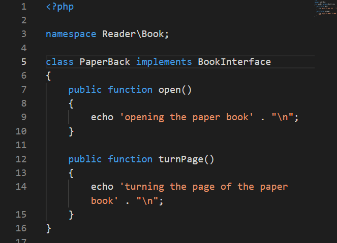
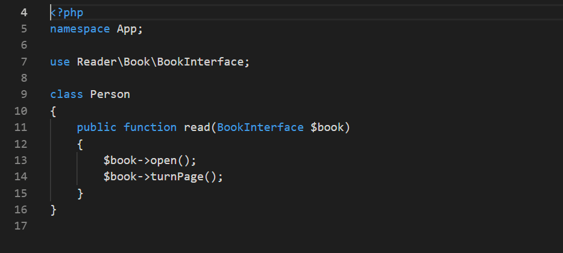
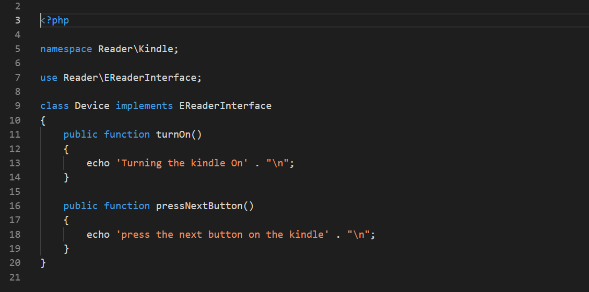
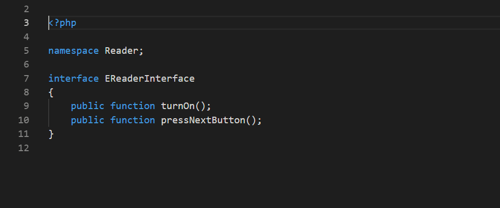
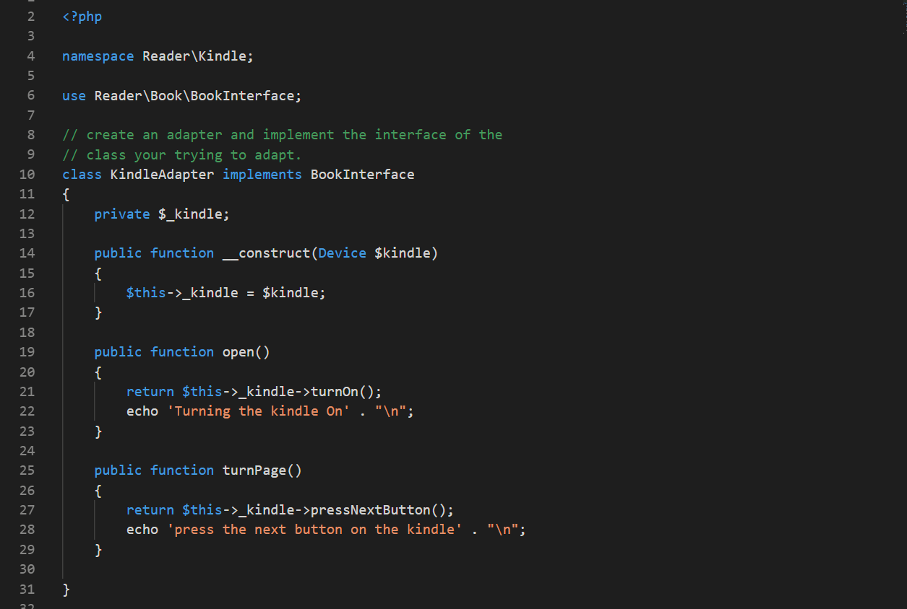
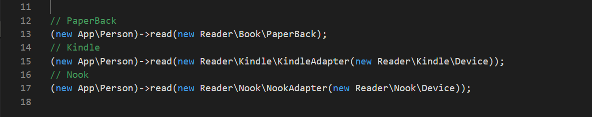

# The Adapter Pattern

	

The adapter pattern allows the developer to add new functionality whilst not changing the users unlying API interface.

### Book/Reader Example

Take that we have a Person Class and they consume a Book class. We provide an interface for the Person to read that Book.

We want to add other devices to read however we DONT want to change our public facing API

> $book->open();

> $book->turnPage();

### Book Class

	

### Book Interface

	

### Person Class

	

So how can we say add a Kindle Reader that does not affect our API as we still wish the code to use these api points?

We can use the Adapter Pattern. This allows us to add an additional Kindle Class that does not alter our read method.

### So how does this work?

1. We create a kindle class.
2. That class implements its own interface and functionality.

### Class Kindle

	

### Kindle Interface

	

3.	We then create an Kindle Adapter class which will allow us to plugin our existing code to the read method interface.
4. This adapter class `implements the original BookInterface`

### Kindle Adapter Class

	

5. We create `a constructor that takes a kindle device`. Here we are injecting that class into the adapter.
6. We then implement the methods of that original BookInterface and during `each methods implementation logic we adapt from the Kindle's interface`.

Then we can create instances by wrapping the kindle device with a Kindle Adapter. 

## Note that the read method on the Person class takes a bookInterface argument.

 `public function read(BookInterface $book)`

 ## This as you can see below is the new kindle device `wrapped` in it's own Adapter.

	

[Author :  Jason Williams @letuscode.co.uk](http://letuscode.co.uk)

[Email : jasonwilliams@letuscode.co.uk](mailto:jasonwilliams@letuscode.co.uk)

